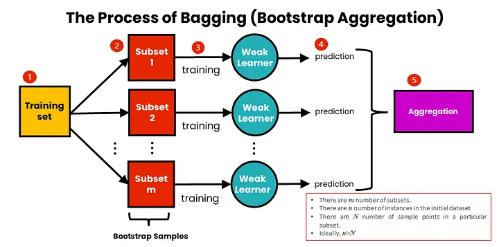
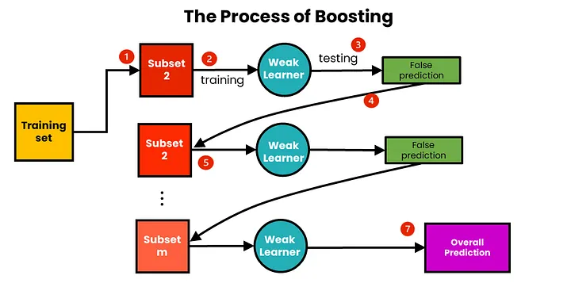
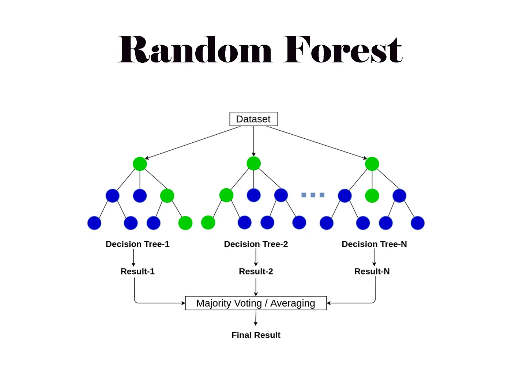

# Ensemble Models

Before going deep into ensemble models, let us first understand a few important foundational concepts.

 

## Bias and Variance

Bias measures how far a model’s predictions are from the true values.
- High bias → The model is too simple and fails to capture the underlying patterns in the data. This usually leads to underfitting.
- Low bias → The model is flexible enough to represent the data more accurately.

Variance refers to how sensitive a model is to changes in the training data.
- High variance → The model is too complex and attempts to fit every data point in the training set.
- As a result, even small changes in the training data can lead to large changes in predictions, which typically causes overfitting.
 

## Underfitting and Overfitting

Underfitting occurs when a model is too simple to capture the underlying structure of the data.
- Characterized by high bias and low variance
- Performs poorly on both training and test datasets

Overfitting occurs when a model learns noise and unnecessary details from the training data instead of the true pattern.
- Characterized by low bias and high variance
- Performs very well on training data but poorly on unseen data

For a model to be ideal, it should have low bias and low variance. However, in practice, achieving both simultaneously is extremely difficult. This trade-off is one of the key reasons why ensemble models are used.

 

## Ensemble Learning

Instead of relying on a single model, ensemble learning builds multiple models and combines their predictions.

Some models in the ensemble may underfit, while others may overfit. However, when their outputs are combined—typically through averaging (regression) or voting (classification)—the overall performance improves. This aggregation helps reduce variance and can partially compensate for bias, leading to better generalization than any individual model.

In simple terms, an ensemble is a collection of models working together.

Each model in an ensemble should be reasonably good, meaning it should perform better than random guessing (a naive or baseline model). If a model consistently performs worse than the baseline, including it in the ensemble can degrade performance instead of improving it.

Types of Ensemble Methods

There are two widely used approaches to ensemble learning:

1. Bagging (Bootstrap Aggregating)
   - Models are trained independently and in parallel on different bootstrapped samples of the training data.
   - The final prediction is obtained by averaging (for regression) or majority voting (for classification).
   - A well-known algorithm based on bagging is Random Forest.
     
  

2. Boosting
   - Models are trained sequentially, where each new model focuses on correcting the errors made by previous models.
   - More weight is given to misclassified or poorly predicted data points.
   - Common boosting algorithms include AdaBoost, Gradient Boosting, and XGBoost.
      
  

 

## Bagging

In bagging, multiple bootstrap samples are created from the original training dataset.
A bootstrap sample is generated by randomly sampling the training data with replacement.

Each bootstrap sample typically contains 40%–70% of the original dataset, with some data points repeated and others left out.This sampling process is called **bootstrapping**.

Using these different bootstrap samples, multiple models are trained independently. One of the most popular algorithms built using this approach is Random Forest, where each model is a decision tree trained on a different bootstrap sample with same set of tree parameters.

Ex :  Random Forest

 

### Random Forest

Random Forest is one of the most widely used bagging algorithms.
- First, multiple bootstrap samples are created from the training dataset.
- Using these samples, multiple decision trees are trained with the same set of parameters, but each tree sees a different subset of the data, which introduces diversity.
- The final prediction is obtained through aggregation:
     - Voting for classification
     - Averaging for regression
 
Key concept:
- At each split in a tree, only a random subset of features is considered.
- Among these features, the tree selects the most informative feature based on metrics such as Gini index or information gain.
- This mechanism ensures that trees are diverse and do not rely on the same dominant features.

  

Advantages of Random Forest: 
- Each tree is independent, allowing parallel training, which speeds up computation.
- By considering different subsets of features, Random Forest reduces the curse of dimensionality.
- Since the final output is an aggregate of all trees, the model is more stable. Changes in a few data points usually affect only some trees, not the entire forest.

Random Forest Metric: Out-of-Bag (OOB) Error
- OOB error is the mean prediction error on each training sample, considering only the trees that did not include that sample during training.
- It serves as an internal cross-validation, providing an unbiased estimate of model performance without needing a separate validation set.

 

## Boosting

Boosting is an ensemble learning technique that differs from bagging mainly in how models are combined.

In boosting, each model is treated as a weak learner, meaning it performs only slightly better than random guessing. These weak learners are then trained sequentially, where each new model focuses on correcting the mistakes made by the previous ones.

By combining these models using different boosting strategies, the ensemble gradually becomes a strong learner. As a result, boosting often achieves higher accuracy and better generalization compared to individual models.

Ex : Ada Boost, Gradient Boosting , XGBoost

 

### AdaBoost (Adaptive Boosting)

Intuition
- AdaBoost starts by training a weak learner using a uniform distribution of weights across all training samples.
- After the initial model makes predictions, the misclassified data points are assigned higher weights.This forces the next weak learner to focus more on the hard-to-predict samples.
- Each weak learner is also assigned a weight based on its performance (models with fewer errors get higher importance).
- This process continues until the specified number of learners is reached.
- The final prediction is obtained as a weighted sum of predictions from all weak learners.

  

In essence, AdaBoost adapts to errors made in earlier stages and progressively improves model performance by learning from its mistakes.

  

### Algorithm

- Inputs
   - Training dataset:

$$
(x_1, y_1), (x_2, y_2), \dots, (x_m, y_m) \quad where  \quad x_i \in \mathbb{R}, \quad y_i \in \{-1, +1\}
$$
  
- Step 1: Initialize Sample Weights
   - All training samples are assigned equal weights initially.
   
$$
\text{Weight of sample } i \text{ for the first weak learner:} \quad
D_1(i) = \frac{1}{m}, \quad \forall\, i = 1, 2, \dots, m
$$
   
- Step 2: Train Weak Learners : For $t = 1$ to $T$, repeat the following steps:
   
     - Train a weak learner $h_t$ (e.g., a decision stump or shallow tree) on the training data using the current weight distribution $D_t$.
   
     - Compute the weighted classification error:
   
$$
\epsilon_t = \sum_{i=1}^{m} D_t(i)\[y_i \neq h_t(x_i)\]
$$

$$
\epsilon_t = \sum_{i=1}^{m} D_t(i)|y_i - h_t(x_i)| \quad \text{for regression}
$$

- Step 3: Compute Weak Learner Importance
   - Assign an importance weight to the weak learner:
   
$$
\alpha_t = \frac{1}{2} \ln\left(\frac{1 - \epsilon_t}{\epsilon_t}\right)
$$

$$
\alpha_t = \frac{1}{2} \ln\left(\frac{1 - \epsilon_t}{\epsilon_t + \delta}\right) \quad \text{for regression}
$$

$\delta$ is a small constant to avoid 0 division error

- Step 4: Update Sample Weights
   - Update the weights of the training samples:
   
$$
D_{t+1}(i) = \frac{D_t(i)\exp\bigl(-\alpha_t y_i h_t(x_i)\bigr)}{Z_t}
$$

$$
D_{t+1}(i) = \frac{D_t(i)\exp\bigl(-\alpha_t |y_i - h_t(x_i)|\bigr)}{Z_t} \quad \text{for regression}
$$

- where:
   - $Z_t$ is a normalization constant ensuring $\sum_i D_{t+1}(i) = 1 \quad \quad Z_t = \sum_i {D_t(i)e^{\bigl(-\alpha_t y_i h_t(x_i)\bigr)}}$
   - $y_i  \times h_t(x_i) = 1$ if the sample is correctly classified
   - $y_i \times h_t(x_i) = -1$ if the sample is misclassified
   - Misclassified samples receive **higher weights**, forcing the next weak learner to focus on harder examples.

- Note :
     - The decision tree is built using the updated sample weights from the current AdaBoost iteration.
     - Instead of using the raw count of samples to calculate metrics like Gini impurity or entropy, the algorithm uses the weighted sum of the samples at each node.
     - This means that samples with higher weights (typically misclassified in previous iterations) have more influence on determining the best feature and threshold for splitting.
     - In this way, the tree is biased toward correctly classifying the hard-to-predict samples, allowing AdaBoost to focus on the most challenging points in the dataset.

| Sample $i$ | True Label $y_i$ | Prediction $h_t(x_i)$ | Correct? | $y_i\times h_t(x_i)$ | 
|--------------|------------------|--------------------------|----------|------------------|
| 1 | +1 | +1 | Yes | 1 |
| 2 | -1 | +1 | No | -1 |
| 3 | +1 | +1 | Yes | 1 |
| 4 | -1 | -1 | Yes | 1 |
| 5 | +1 | -1 | No | -1 |

- Step 5: Final Prediction
   - The final strong classifier is a weighted sum of all weak learners:
   
$$
H(x) = \text{sign}\left(\sum_{t=1}^{T} \alpha_t h_t(x)\right)
$$

$$
H(x) = \sum_{t=1}^{T} \alpha_t h_t(x)  \quad \text{for regression}
$$

  

### Classification Example: 

 

| Sample $i$ | True Label $y_i$ |
|--------------|------------------|
| 1 | +1 |
| 2 | +1 |
| 3 | -1 |
| 4 | +1 |
| 5 | -1 |
| 6 | -1 |

Let T = 2

Step 1 : Initial weight 

$$
D_1(i) = \frac{1}{\text{len(samples) = 6}} = 0.16
$$

we build a tree model $h_1$

| Sample $i$ | True Label $y_i$ | weights  $D_1$ for $h_1$| Predictions $h_1(x_i)$ |
|------------|------------------|-------------------------|------------------------|
| 1 | +1 | 0.16 | +1 |
| 2 | +1 | 0.16 | -1 |
| 3 | -1 | 0.16 | +1 |
| 4 | +1 | 0.16 | +1 |
| 5 | -1 | 0.16 | -1 |
| 6 | -1 | 0.16 | -1 |

two samples were misclassified , so 

$$
\epsilon_1 = \sum_{i=1}^{m} D_1\[y_i \neq h_1(x_i)\]
$$
$$
\epsilon_1 = \text{ weightage of sample 2 + weightage of sample 3 }
$$
$$
\epsilon_1 = 0.16 + 0.16 = 0.32
$$

$h_1$ model weightage in final say

$$
\alpha_1 = \frac{1}{2} \ln\left(\frac{1 - \epsilon_1}{\epsilon_1}\right)
$$

$$
\alpha_1 = \frac{1}{2} \ln\left(\frac{1 - 0.32}{0.32}\right) = 0.75
$$

The new weight for each sample is calculated as :

New weightage  = old weightage * $e^{\bigl(-\alpha_t y_i h_t(x_i)\bigr)}$

- Here $\alpha_1$ = 0.75 and $y_i h_t(x_i)$ returns **+1** if the sample is correctly classified, **-1** if misclassified  
- For correct prediction $e^{-0.75 *  (+1) }$ = 0.472
- For wrong prediction $e^{-0.75 *  (-1) }$ = 2.11

**Interpretation:**  
- For **correctly classified samples**, the weight **decreases**, making them less important in the next iteration.  
- For **misclassified samples**, the weight **increases exponentially**, forcing the next weak learner to focus on these harder examples.

| Sample $i$ | True Label $y_i$ | weights  $D_1$ for $h_1$| Predictions $h_1(x_i)$ | updated weightage after $h_1$ | Normalized weight |
|------------|------------------|-------------------------|------------------------|-------------------------------|-------------------|
| 1 | +1 | 0.16 | +1 | 0.16 * 0.472 = 0.075 | $\frac{0.075}{0.075*4 + 0.338 * 2}$ = 0.08 |
| 2 | +1 | 0.16 | -1 | 0.16 * 2.11 = 0.338 | $\frac{0.338}{0.075*4 + 0.338 * 2}$ = 0.375 |
| 3 | -1 | 0.16 | +1 | 0.16 * 2.11 = 0.338 | $\frac{0.338}{0.075*4 + 0.338 * 2}$ = 0.375 |
| 4 | +1 | 0.16 | +1 | 0.16 * 0.472 = 0.075 | $\frac{0.075}{0.075*4 + 0.338 * 2}$ = 0.08 |
| 5 | -1 | 0.16 | -1 | 0.16 * 0.472 = 0.075 | $\frac{0.075}{0.075*4 + 0.338 * 2}$ = 0.08 |
| 6 | -1 | 0.16 | -1 | 0.16 * 0.472 = 0.075 | $\frac{0.075}{0.075*4 + 0.338 * 2}$ = 0.08 |

Now we build $h_2$

| Sample $i$ | True Label $y_i$ | $\alpha_1$ for $h_1$| Predictions $h_1(x_i)$ | Normalized weight | Predictions of $h_2$ |
|------------|------------------|-------------------------|------------------------|-------------------------------|-------------------|
| 1 | +1 | 0.75 | +1 | 0.08  | +1 |
| 2 | +1 | 0.75 | -1 | 0.375 | +1 |
| 3 | -1 | 0.75 | +1 | 0.375 | -1 |
| 4 | +1 | 0.75 | +1 | 0.08  | +1 |
| 5 | -1 | 0.75 | -1 | 0.08  | +1 |
| 6 | -1 | 0.75 | -1 | 0.08  | -1 |

One sample was misclassified , so 

$$
\epsilon_2 = \sum_{i=1}^{m} D_2\[y_i \neq h_2(x_i)\]
$$
$$
\epsilon_2 = 0.08
$$

$h_2$ model weightage in final say

$$
\alpha_2 = \frac{1}{2} \ln\left(\frac{1 - \epsilon_2}{\epsilon_2}\right)
$$

$$
\alpha_2 = \frac{1}{2} \ln\left(\frac{1 - 0.08}{0.08}\right) = 1.22
$$

Final Precitions 

| Sample $i$ | True Label $y_i$ | $\alpha_1$ for $h_1$| Predictions of $h_1$ | $\alpha_2$ for $h_2$ | Predictions of $h_2$ | Final Prediction |
|------------|------------------|---------------------|------------------------|----------------------|----------------------|------------------|
| 1 | +1 | 0.75 | +1 | 1.22  | +1 | sign(0.75*1 + 1.22 * 1 = +1.97) = +1 |
| 2 | +1 | 0.75 | -1 | 1.22  | +1 | sign(0.75*-1 + 1.22 * 1 = +0.47) = +1 |
| 3 | -1 | 0.75 | +1 | 1.22  | -1 | sign(0.75*1 + 1.22 * 1 = -0.47) = -1 |
| 4 | +1 | 0.75 | +1 | 1.22  | +1 | sign(0.75*1 + 1.22 * 1 = +1.97) = +1 |
| 5 | -1 | 0.75 | -1 | 1.22  | +1 | sign(0.75*1 + 1.22 * 1 = -1.97) = -1 |
| 6 | -1 | 0.75 | -1 | 1.22  | -1 | sign(0.75*1 + 1.22 * 1 = -1.97) = -1 |
| **Metrics** |  |  | **Accuracy: 0.66** |  | **Accuracy: 0.83** | **Accuracy: 1.00** |
|  |  |  | **Precision: 0.67** |  | **Precision: 1.00** | **Precision: 1.00** |
|  |  |  | **Recall: 1.00** |  | **Recall: 0.75** | **Recall: 1.00** ||

 

### Regression Example

| Sample $i$ | True Value $y_i$ |
|------------|------------------|
| 1 | 3 |
| 2 | 5 |
| 3 | 7 |
| 4 | 9 |
| 5 | 11 |
| 6 | 13 |

Let **T = 2**

- Step 1: Initial Weights

$$
D_1(i) = \frac{1}{\text{len(samples)} = 6} = 0.166
$$

   - Build First Weak Regressor $h_1$

| Sample $i$ | True Value $y_i$ | Weights $D_1$ | Prediction $h_1(x_i)$ |
|------------|------------------|---------------|------------------------|
| 1 | 3 | 0.166 | 2.5 |
| 2 | 5 | 0.166 | 4.0 |
| 3 | 7 | 0.166 | 6.0 |
| 4 | 9 | 0.166 | 10.5 |
| 5 | 11 | 0.166 | 10.0 |
| 6 | 13 | 0.166 | 12.0 |

- Step 2: Compute Absolute Errors

$$
e_i = |y_i - h_1(x_i)|
$$

| Sample $i$ | True Value $y_i$  | Prediction $h_1(x_i)$ | Absolute Error |
|------------|------------------|---------------|--------------|
| 1 | 3  | 2.5 | 0.5 |
| 2 | 5  | 4.0 | 1.0 |
| 3 | 7  | 6.0 | 1.0 |
| 4 | 9  | 10.5 | 1.5 |
| 5 | 11 | 10.0 | 1.0 |
| 6 | 13 | 12.0 | 1.0 |

Maximum error:

$$
e_{\max} = 1.5
$$

- Step 3: Normalized Errors

$$
e_i^{norm} = \frac{e_i}{e_{\max}}
$$

| Sample $i$ | Normalized Error |
|------------|------------------|
| 1 | 0.33 |
| 2 | 0.67 |
| 3 | 0.67 |
| 4 | 1.00 |
| 5 | 0.67 |
| 6 | 0.67 |

- Step 4: Weighted Error

$$
\epsilon_1 = \sum_{i=1}^{m} D_1(i)\, e_i^{norm}
$$

$$
\epsilon_1 = 0.166(0.33 + 0.67 + 0.67 + 1.00 + 0.67 + 0.67) = 0.67
$$

- Step 5: Model Weight

$$
\beta_1 = \frac{\epsilon_1}{1 - \epsilon_1} = \frac{0.67}{0.33} = 2.03
$$

$$
\alpha_1 = \ln\left(\frac{1}{\beta_1}\right) = \ln(0.49) \approx -0.71
$$

- Step 6: Update Sample Weights

$$
D_2(i) = D_1(i) \cdot \beta_1^{(1 - e_i^{norm})}
$$

| Sample $i$ | Old Weight | Updated Weight | Normalized Weight |
|------------|------------|----------------|-------------------|
| 1 | 0.166 | 0.27 | 0.22 |
| 2 | 0.166 | 0.20 | 0.16 |
| 3 | 0.166 | 0.20 | 0.16 |
| 4 | 0.166 | 0.17 | 0.14 |
| 5 | 0.166 | 0.20 | 0.16 |
| 6 | 0.166 | 0.20 | 0.16 |

**Interpretation:**  
- Samples with **larger prediction error receive higher weights**  
- Next model focuses more on these difficult samples

---

## Build Second Weak Regressor $h_2$

| Sample $i$ | True Value $y_i$ | Normalized Weight | Prediction $h_2(x_i)$ |
|------------|------------------|-------------------|------------------------|
| 1 | 3 | 0.22 | 3.1 |
| 2 | 5 | 0.16 | 5.2 |
| 3 | 7 | 0.16 | 7.0 |
| 4 | 9 | 0.14 | 8.8 |
| 5 | 11 | 0.16 | 11.1 |
| 6 | 13 | 0.16 | 13.0 |

---

## Step 7: Compute Second Model Error

| Sample $i$ | Absolute Error |
|------------|----------------|
| 1 | 0.1 |
| 2 | 0.2 |
| 3 | 0.0 |
| 4 | 0.2 |
| 5 | 0.1 |
| 6 | 0.0 |

$$
\epsilon_2 = 0.13
$$

---

## Step 8: Second Model Weight

$$
\beta_2 = \frac{\epsilon_2}{1 - \epsilon_2} = 0.15
$$

$$
\alpha_2 = \ln\left(\frac{1}{\beta_2}\right) = 1.90
$$

---

## Final Prediction

AdaBoost **Regression** combines models using a **weighted median**, not majority voting.

| Sample $i$ | $h_1(x)$ | $h_2(x)$ | Final Prediction |
|------------|----------|----------|------------------|
| 1 | 2.5 | 3.1 | 3.1 |
| 2 | 4.0 | 5.2 | 5.2 |
| 3 | 6.0 | 7.0 | 7.0 |
| 4 | 10.5 | 8.8 | 8.8 |
| 5 | 10.0 | 11.1 | 11.1 |
| 6 | 12.0 | 13.0 | 13.0 |

---

## Key Difference from Classification

- ❌ No **sign** function  
- ❌ No majority voting  
- ✅ Uses **error-weighted median**
- ✅ Focuses on **reducing large residuals**

---

### Gradient Boosting

Intuition
- Gradient Boosting builds ensembles sequentially, but instead of reweighting samples like AdaBoost, each new model is trained to predict the residual errors (the difference between actual and predicted values) of the previous ensemble.
- The idea is to correct the mistakes of the previous models by minimizing a loss function (e.g., MSE for regression, log loss for classification).
- Each weak learner contributes to improving the overall prediction in proportion to a learning rate.

 

  

 

Basic Understanding:

- Inputs
  - Traning dataset:
  
$$
(x_1, y_1), (x_2, y_2), \dots, (x_n, y_n)
$$

- For whatever the function we want

$$
\hat{F} = argmin_F \quad E_{x,y}\[L(x, F(x))\]
$$

here for regression 

$$
L(x, F(x)) = (y−F(x))^2
$$

$$
E_{x,y}\[L(x, F(x))\] ≈ \frac{1}{n}\sum_{i=0}^n L(x_i, F(x_i))
$$

- Gradient booosting method assumes a real-valued y. It seeks an approximation $\hat{F}(x)$ in the form of a weighted sum of $M$ functions $h_m(x)$ from some class of $H$(weak learners), with $\gamma_m$ weightage at stage $m$ 

$$
\hat{F}(x) = {\sum_{m=1}^M \gamma_m h_m(x)} + const
$$

- The method tries to find an approproximation $\hat{F}(x)$ that minimizes thr average value of the loss function on the training set.
- Thus it does so by starting with a model consisting of a constant function $F_0(x)$, and incrementally expands it in a greedy fashion.

$$
F_0(x) = argmin_{h_m \in H} \sum_{i=1}^n L(y_i,h_m(x_i))
$$

$$
F_m(x) = F_{m-1}(x) + \left(argmin_{h_m \in H}\left[ \sum_{i=1}^n L(y_i,F_{m-1}(x_i)+ h_m(x_i))\right]\right)(x)
$$

 
Algorithm

- **Inputs:**  
  Training dataset:  

$$
(x_1, y_1), (x_2, y_2), \dots, (x_m, y_m) \quad \text{where } x_i \in \mathbb{R}, y_i \in \{-1, +1\}
$$

- **Step 1: Initialize model**  

$$
F_0(x) = \arg\min_{\gamma} \sum_{i=1}^m L(y_i, \gamma)
$$

For binary classification, we can take:

$$
F_0(x) = 0
$$

- **Step 2: For $t = 1$ to $T$, repeat:**  

1. **Compute residuals:**  

$$
r_{i,t} = - \left[ \frac{\partial L(y_i, F(x_i))}{\partial F(x_i)} \right]_{F(x) = F_{t-1}(x)}
$$

For classification with labels $\{-1, +1\}$ and exponential loss:  

$$
r_{i,t} = y_i - F_{t-1}(x_i)
$$

2. **Fit weak learner** $h_t(x)$ to residuals $r_{i,t}$.  

3. **Compute multiplier** $\gamma_t$ by minimizing loss:  

$$
\gamma_t = \arg\min_{\gamma} \sum_{i=1}^m L(y_i, F_{t-1}(x_i) + \gamma h_t(x_i))
$$

4. **Update ensemble prediction:**  

$$
F_t(x) = F_{t-1}(x) + \nu \gamma_t h_t(x)
$$

where $\nu$ is the learning rate.

- **Step 3: Final prediction**

$$
H(x_i) = \text{sign}(F_T(x_i))
$$

## Step-by-Step Example

### Training Data

| Sample $i$ | Feature $x_i$ | True Label $y_i$ |
|------------|----------------|----------------|
| 1          | 1.0            | +1             |
| 2          | 2.0            | +1             |
| 3          | 3.0            | -1             |
| 4          | 4.0            | +1             |
| 5          | 5.0            | -1             |
| 6          | 6.0            | -1             |

- Let $T = 2$ weak learners and learning rate $\nu = 1$ for simplicity.

---

### Step 1: Initialize Model

$$
F_0(x) = 0
$$

---

### Step 2: First Weak Learner

- **Residuals:**  

| Sample $i$ | True Label $y_i$ | Residual $r_i$ |
|------------|-----------------|----------------|
| 1          | +1              | +1             |
| 2          | +1              | +1             |
| 3          | -1              | -1             |
| 4          | +1              | +1             |
| 5          | -1              | -1             |
| 6          | -1              | -1             |

- **Weak learner $h_1(x)$** predictions:  

| Sample $i$ | $h_1(x_i)$ |
|------------|------------|
| 1          | +1         |
| 2          | +1         |
| 3          | -1         |
| 4          | +1         |
| 5          | -1         |
| 6          | -1         |

- **Multiplier $\gamma_1 = 0.75$**, update prediction:  

$$
F_1(x_i) = F_0(x_i) + \gamma_1 h_1(x_i)
$$

| Sample $i$ | $F_1(x_i)$ |
|------------|------------|
| 1          | 0.75       |
| 2          | 0.75       |
| 3          | -0.75      |
| 4          | 0.75       |
| 5          | -0.75      |
| 6          | -0.75      |

---

### Step 3: Second Weak Learner

- **Residuals:**  

| Sample $i$ | $y_i$ | $F_1(x_i)$ | Residual $r_i = y_i - F_1(x_i)$ |
|------------|-------|------------|--------------------------------|
| 1          | +1    | 0.75       | 0.25                           |
| 2          | +1    | 0.75       | 0.25                           |
| 3          | -1    | -0.75      | -0.25                          |
| 4          | +1    | 0.75       | 0.25                           |
| 5          | -1    | -0.75      | -0.25                          |
| 6          | -1    | -0.75      | -0.25                          |

- **Weak learner $h_2(x)$** predictions:  

| Sample $i$ | $h_2(x_i)$ |
|------------|------------|
| 1          | +1         |
| 2          | +1         |
| 3          | -1         |
| 4          | +1         |
| 5          | -1         |
| 6          | -1         |

- **Multiplier $\gamma_2 = 1.22$**, update prediction:  

$$
F_2(x_i) = F_1(x_i) + \gamma_2 h_2(x_i)
$$

| Sample $i$ | $F_2(x_i)$ |
|------------|------------|
| 1          | 1.97       |
| 2          | 1.97       |
| 3          | -1.97      |
| 4          | 1.97       |
| 5          | -1.97      |
| 6          | -1.97      |

---

### Step 4: Final Predictions

$$
H(x_i) = \text{sign}(F_2(x_i))
$$

| Sample $i$ | True Label $y_i$ | Final Prediction $H(x_i)$ |
|------------|-----------------|---------------------------|
| 1          | +1              | +1                        |
| 2          | +1              | +1                        |
| 3          | -1              | -1                        |
| 4          | +1              | +1                        |
| 5          | -1              | -1                        |
| 6          | -1              | -1                        |

**Metrics:**  
- Accuracy = 100%  
- Precision = 1.0  
- Recall = 1.0

